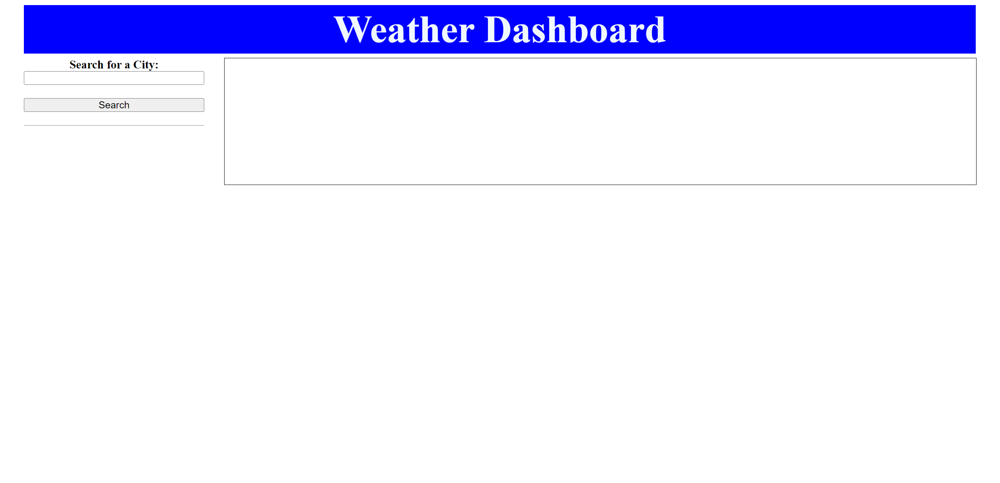
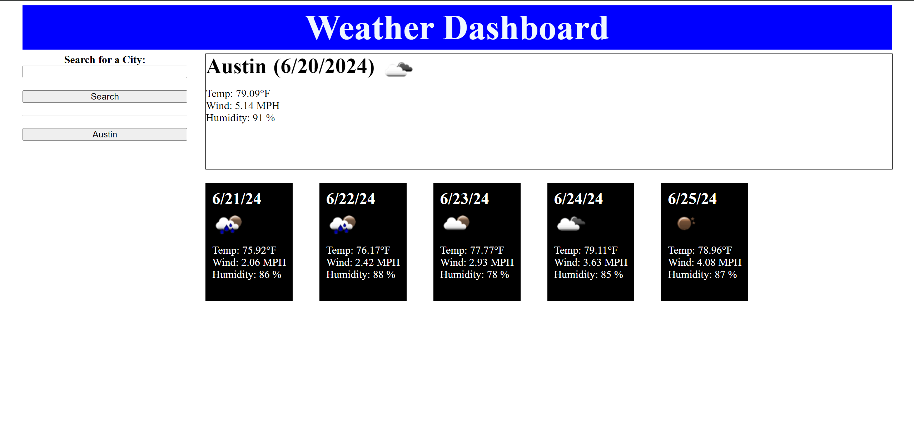
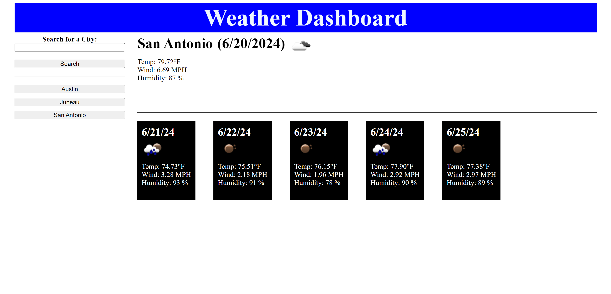

# Weather-6

Description:
This repo was created to showcase a simple weather forecast site.

Installation: 
N/A

Usage:
To use this repo, type a city name into the search bar, click the search button and you will receive the current day's forecast and the forecast for the next 5 days. You can also dig through the javascript file and learn how to use an api to fetch infomation and create new html elements based on that information.

Link to site:
https://stringer-j.github.io/Weather-6/

Credits: 
N/A

License: 
Refer to the LICENSE in the repo.

Note for Grader: 
Used the Xpert AI and numerous other sources across the internet. Couldn't figure out local storage for this project but had to move on as I'm behind in class already as it is.

